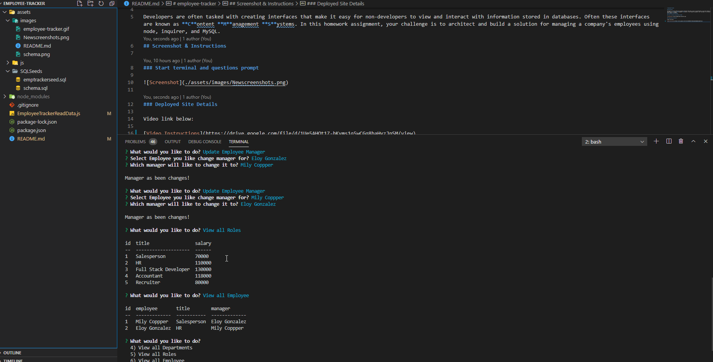

# employee-tracker

## Description

Developers are often tasked with creating interfaces that make it easy for non-developers to view and interact with information stored in databases. Often these interfaces are known as **C**ontent **M**anagement **S**ystems. In this homework assignment, your challenge is to architect and build a solution for managing a company's employees using node, inquirer, and MySQL.
## Screenshot & Instructions

### Start terminal and questions prompt

### Deployed Site Details

Video link below:

[Video Instructions](https://drive.google.com/file/d/1YbyhDjekcOnz4TaNOR-lGxG0GLOLqML_/view)
